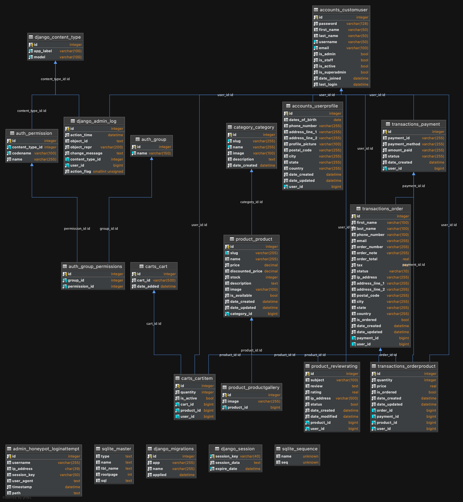

# DATABASE DOCUMENTATION (SE05_RelationalDatabase)
 

## 1. This project uses 2 different databases:

* Development Stage (Localhost): SQLITE3
* Production Stage (AWS with RDS): PostgreSQL
 

## 2a. This project has 11 classes which create 11 relational database tables:

* ### Accounts App (accounts/models.py):
  * (ORM) Class CustomUser <=> (SQL Table) accounts_customuser
  * (ORM) Class UserProfile <=> (SQL Table) accounts_userprofile
 

* ### Carts App (carts/models.py):
  * (ORM) Class Cart <=> (SQL Table) carts_cart
  * (ORM) Class CartItem <=> (SQL Table) carts_cartitem
 

* ### Category App (category/models.py):
  * (ORM) Class Category <=> (SQL Table) category_category
 

* ### Product App (product/models.py):
  * (ORM) Class Product <=> (SQL Table) product_product
  * (ORM) Class ReviewRating <=> (SQL Table) product_reviewrating
  * (ORM) Class ProductGallery <=> (SQL Table) product_productgallery
 

* ### Transactions App (transactions/models.py):
  * (ORM) Class Payment <=> (SQL Table) transactions_payment
  * (ORM) Class Order <=> (SQL Table) transactions_order
  * (ORM) Class OrderProduct <=> (SQL Table) transactions_orderproduct

## 2b. Django Web Framework also provides default classes which create 7 relational database tables:
  * (ORM) Class DjangoContentType <=> (SQL Table) django_content_type
  * (ORM) Class DjangoAdminLog <=> (SQL Table) django_admin_log
  * (ORM) Class AuthPermission <=> (SQL Table) auth_permission
  * (ORM) Class AuthGroup <=> (SQL Table) auth_group
  * (ORM) Class AuthGroupPermission <=> (SQL Table) auth_group_permission
  * (ORM) Class DjangSession <=> (SQL Table) django_session
  * (ORM) Class DjangoMigration <=> (SQL Table) django_migration

## 2c. Django Web Framework also provides 2 pre-made classes for using SQLITE which create 2 relational database table:
* (ORM) Class SQLiteSequence <=> (SQL Table) sqlite_sequence
* (ORM) Class SQLiteMaster <=> (SQL Table) sqlite_master

## 2d. For upgrading this project's admin login security, I decided to use a plugin called "django-admin-honeypot" that creates 1 relational database table:
* (ORM) Class AdminHoneypotLoginAttempt <=> (SQL Table) admin_honeypot_login_attempt

## 3. Entity-Relationship Model:

 
 

## 4a. Index-ing in Django:
* Declared inside the meta class in each django class
* Syntax: "ordering = ("index",)"
* Adding a "-" before the "index" in the tupple will access the row from the database table with that particular index (column) in the descending order

## 4b. Example for indexing:
### class CustomUser:
### ...
### class Meta:
### ordering = ('-date_joined',)
### ...

## The output of the above example will start with users who registered the most recent.
 
 

## 5. All queries used in this project can be found in each .py file in this directory. Each .py file represents one django app.