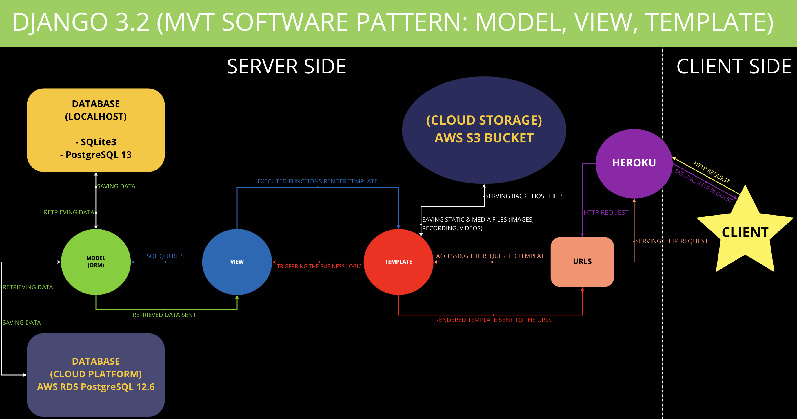

#  **Stolen Goods** | https://www.stolengoods.wtf

# 1. Project Details:
## University:
* Code University of Applied Sciences
## Semester:
* Semester 2 / Spring Semester 2021

## Module Details:
* Module Coordinator: Dr. Adam Roe
* Modules:
  * SE01: Software Development Basic
  * SE19: Web Technology Basic

* Module Coordinator: Prof. Dr. Peter Ruppel
* Module:
  * SE05: Relational Database

* Module Coordinator: Prof. Dr. Ulrich von Zadow
* Module:
  * E10: Automated Software Testing

## Technical Details:
* Programming Language:
  * Python 3.9.2
  * Javascript
  
* Templating System:
  * Jinja 2
  * HTML
  * CSS

* Web Framework:
  * Django 3.2
  * Bootstrap 5

* Testing Framework:
  * Django pytest
  * Pytest
  * Coverage
  * Pytest-Cov

* Database:
  * Development Stage (Localhost):
    * SQLite3
    * PostgreSQL 13
  * Production Stage:
    * AWS RDS PostgreSQL 12.6

* Static File Storage System:
  * AWS S3 Bucket

* Hosting:
  * NameCheap
  * Heroku

* Paypal Integration:
  * Paypal Sandbox with Business Account

# 2. Project Intro
"Stolen Goods" is a fun parody project simulating an international e-commerce that sells items from criminals to collectors around the world. Even though this is only a parody, this web application has a fully functioning features like any other e-commerce platform.

# 3. MVT Software Pattern
Django is a free, open-source, and high-level Python web framework that encourages rapid development and clean pragmatic design and follows the MTV (Model - Template - View) software architectural patterns. Django consists of an ORM (Object-Relational Mapper) that connects data models defined as Python classes and the database, a system to process HTTP requests with a web templating system, and a RegEx-based URL dispatcher.

# 4. Django ORM
Django uses Object-Relational Mapper that can be connected to any database. This project uses SQLite3 during the development stage for its simple fungtionality purpose and PostgreSQL for its scalability in production. PostgreSQL is used both in localhost with DataGrip and online with AWS RDS. This project has 11 relational database tables excluding the default django classes (i.e. auth_permission, auth_group, etc.).

# 5. Project Objective
* The main objective of this project is to implement the knowledge in web development and software engineering gained in spring semester 2021 by programming a fully-functional software that runs a web application.

* My private goal is to prove the superiority of Python over other programming languages by creating a web application only with a Python Web Framework: Django.

# 6. Project Setup
* Clone / Download the repository

* Make sure you have python 8.x or higher, othwerwise [Upgrade Your Python](https://www.python.org/downloads/) or run "brew upgrade python" on your terminal

* Create a virtual env "python -m venv <YOUR_VENV_NAME>" or "mkvirtualenv <YOUR_VENV_NAME>"

* Activate virtualenv "Source <YOUR_VENV_NAME>/bin/activate" or "workon <YOUR_VENV_NAME>"

* Install all the modules "pip install -r requirements.txt"

* All the credentils from in configurations/settings.py are saved in .env file. Please assign your own credentials to all variables provided in this repo file: ".env-secrets"  

* Create the database:
  * "python manage.py makemigrations"
  * "python manage.py migrate"

* Create an admin "python manage.py createsuperuser"

* Set up the local server: "python manage.py runserver"

* To login as an admin go to 'http://127.0.0.1:8000/stolen-goods-admin/'

# 7. Relational Database
Everytime we add or change the database, the django application will not be automatically connected. This is why we always need to re-run:
* "python manage.py makemigrations"

* "python manage.py migrate"

* "python manage.py createsuperuser"

# 7a. Setup
For the database setup, I assumed that you atleast have Postgres.app, if not [Download here](https://postgresapp.com/downloads.html)

* Activate your postgres service on postgres app or run "pg_start"

* Open DataGrip or your prefered IDE for database
* ## SQLite3 Setup:
  * Upload the .sqlite3 file "New => Data Source => SQLite3 => File"

  * Click "Test connection" and then "ok"

* ## PostgreSQL (Localhost):
  * Connecting PostgreSQL 13.2 "New => Data Source => PostgreSql"

  * Fill in the credentials

  * Click "Test connection" and then "ok"

* ## PostgreSQL (AWS RDS):
  * Signin to your [AWS](https://signin.aws.amazon.com/signin?redirect_uri=https%3A%2F%2Fconsole.aws.amazon.com%2Fconsole%2Fhome%3Ffromtb%3Dtrue%26hashArgs%3D%2523%26isauthcode%3Dtrue%26nc2%3Dh_ct%26src%3Dheader-signin%26state%3DhashArgsFromTB_us-east-1_89ab805abe155024&client_id=arn%3Aaws%3Asignin%3A%3A%3Aconsole%2Fcanvas&forceMobileApp=0&code_challenge=3yzEx5_jmEbzHM1BYCd2CjiMWXVN0KDTdhVDC3KaBfU&code_challenge_method=SHA-256) or [Signup](https://portal.aws.amazon.com/billing/signup?refid=em_127222&redirect_url=https%3A%2F%2Faws.amazon.com%2Fregistration-confirmation#/start)

  * Create Database, choose PostgreSQL 12.6

  * Copy your "Endpoint" under "Connectivity & Security"

  * Open DataGrip and "New => Data Source => PostgreSql"

  * Paste your endpoint in the "Host" input

  * Type in your AWS RDS username in the "USER"

  * Type in the password for that username

  * Click "Test connection" and then "ok"

# 7b. Entity-Relationship Model
## 11 Database Tables based on 5 Django App's models:
* ### Accounts App (accounts/models.py):
  * (ORM) Class CustomUser <=> (Relational Database Table) accounts_customuser

  * (ORM) Class UserProfile <=> (Relational Database Table) accounts_userprofile

* ### Carts App (carts/models.py):
  * (ORM) Class Cart <=> (Relational Database Table) carts_cart

  * (ORM) Class CartItem <=> (Relational Database Table) carts_cartitem

* ### Category App (category/models.py):
  * (ORM) Class Category <=> (Relational Database Table) category_category

* ### Product App (product/models.py):
  * (ORM) Class Product <=> (Relational Database Table) product_product

  * (ORM) Class ReviewRating <=> (Relational Database Table) product_reviewrating

  * (ORM) Class ProductGallery <=> (Relational Database Table) product_productgallery

* ### Transactions App (transactions/models.py):
  * (ORM) Class Payment <=> (Relational Database Table) transactions_payment

  * (ORM) Class Order <=> (Relational Database Table) transactions_order

  * (ORM) Class OrderProduct <=> (Relational Database Table) transactions_orderproduct

## Django also provides 2 pre-made classes for using SQLite3 which create 2 relational database tables:
* (ORM) Class SQLiteSequence <=> (Relational Database Table) sqlite_sequence

* (ORM) Class SQLiteMaster <=> (Relational Database Table) sqlite_master

## For upgrading this project's admin login security, this project uses a plugin called "django-admin-honeypot" that creates 1 relational database table:
* (ORM) Class AdminHoneypotLoginAttempt <=> (Relational Database Table) admin_honeypot_login_attempt

## Relationships:
* One-to-One:
  * (One) CustomUser => (One) UserProfile

* One-to-Many:
  * (One) Category => (Many) Product
  
  * (One) Product => (Many) ProductGallery
  
  * (One) Product => (Many) ReviewRating

  * (One) Product => (Many) CartItem

  * (One) Cart => (Many) CartItem

  * (One) CustomUser => (Many) CartItem

  * (One) CustomUser => (Many) ReviewRating

  * (One) CustomUser => (Many) Payment

  * (One) CustomUser => (Many) Order

  * (One) Payment => (Many) Order

  * (One) Order => (Many) OrderProduct

  * (One) Product => (Many) OrderProduct

  * (One) Payment => (Many) OrderProduct

  * (One) CustomUser => (Many) OrderProduct

## PostgreSQL 13.2:
* 11 Relational Database Tables

* 7 Django-Default Relational Database Tables

* 1 Honeypot Admin Package Relational Database Table

## SQLite3:
* 11 Relational Database Tables

* 7 Django-Default Relational Database Tables

* 2 SQLite-Default Relational Database Tables

* 1 Honeypot Admin Package Relational Database Table

# 7c. Database Queries used in this Project
## SQL Query 1:
  * CREATE TABLE table_name(table_column);
  
  * Query with python:
    * Create a python class in your_app_name/models.py:
      * class TableName(models.Model)

    * On the terminal run:
      * python manage.py makemigrations

      * python manage.py migrate
#

## SQL Query 2:
  * INSERT INTO accounts_customuser(email, username, password) VALUES("admin@stolengoods.wtf", "admin", "admin123");
  
  * Query with python:
    * custom_user = CustomUser.objects.create_user(email="admin@stolengoods.wtf", username="admin", pasword="admin123")
#

## SQL Query 3:
* INSERT INTO accounts_user_profile(id, first_name, last_name, user_id) VALUES(1, "nino", "lindenberg", 1);

* Query with python:  
  * current_user = request.user

  * profile = UserProfile()

  * profile.user_id = user.id

  * profile.save()
#

## SQL Query 4:
* SELECT * FROM table_name;

* Query with python:
  * products = Product.objects.all()
#

## SQL Query 5:
  * SELECT * FROM carts_cartitem INNER JOIN ON carts_cartitem.acounts_customuser_id = accounts_customuser.id;

  * Query with python:
    * current_user = request.user

    * cart_items_from_current_user = CartItem.objects.filter(user=current_user)
#

## SQL Query 6:
* SELECT * FROM product_product WHERE is_availabel='True' ORDER BY id;

* Query with python:
  * products = Product.objects.all().filter(is_available=True).order_by('id')
#

## SQL Query 7:
  * SELECT username FROM accounts_customuser WHERE username = auth_user.username;
  * UPDATE accounts_customuser SET password = "new password";

  * Query with python:
    * user = User.objects.get(username__exact=request.user.username)

    * user.set_password("new_password")

    * user.save()

# 7d. Index-ing in Django:
* Index is declared inside the meta class in each python class in models.py

* Syntax: ordering = ("your index",)

* Adding a "-" before the "your index" inside the tupple will access the row from the database table with that particular index (column) in the descending order

# 8. CI / CD
The CI/CD implemented in this project is using the GitHub Actions which is written in YAML syntax in a .yaml or .yml file and saved in .github/workflows directory.

## Continuous Integration (CI):
CI is the practice of automating the integration of code changes from multiple contributors or contributions into a single software project.

* The main jobs in this CI:
  * 3 jobs in which each will be running on 3 different python versions (3.7, 3.8, 3.9)
  
  * Using docker vm container from GitHub to check the health of PostgreSQL used in this project
  
  * Linting with Flake8 to make sure that the code is written based on a good clean code convention
  
  * Testing with "Pytest-Cov" to make sure that the program will not break in production

## Continuous Deployment (CD):
CD is a strategy for software releases wherein any code commit that passes the automated testing phase is automatically released into the production environment, making changes that are visible to the software's users. 

* The job for the CD in this project is created to make sure that only codes which have passed the Pytest-Cov will be pushed to Heroku to be deployed into the production stage

# 9. Hosting
This project uses Heroku (PaaS: Platform as a Service) which is a cloud-based, scalable server solution that allows developers to easily manage the deployment of their web applications. The name "stolengoods.wtf" and a validated PositiveSSL certificate is bought and issued through NameCheap.

# 10. Paypal Integration
For demo purpose, this project uses "Paypal Sandbox Integration" with Javascript. To process the purchase. please use this credentials:

* Paypal Sandbox Account: maxi.musterfrau@gmail.com

* Paypal Sandbox Password: yxcasdqwe123!

# 11. Learning Resources
* Udemy:
  * [Python & Django Full Stack Web Developer Bootcamp](https://www.udemy.com/share/101WwECUYfd1ZVQXg=/)
  * [The Complete SQL Bootcamp 2021: Go From Zero to Hero](https://www.udemy.com/share/101WsUCUYfd1ZVQXg=/)
  * [Automated Software Testing with Python](https://www.udemy.com/share/1021gqCUYfd1ZVQXg=/)
  * [Real World Python Test Automation with Pytest (Django App)](https://www.udemy.com/share/104wzCCUYfd1ZVQXg=/)
  * [Docker & Kubernetes the Complete Guide](https://www.udemy.com/share/101WReCUYfd1ZVQXg=/)

* Coursera:
  * [Django for Everybody Specialization](https://www.coursera.org/specializations/django?skipBrowseRedirect=true)
  * [PostgreSQL for Everybody Specialization](https://www.coursera.org/specializations/postgresql-for-everybody)

* Django Official Documentation Website:
  * https://www.djangoproject.com/start/overview/

* Django Rest Framework (DRF):
  * https://www.django-rest-framework.org/

* Stackoverflow:
  * https://stackoverflow.com/

* BUGS from all of the students from "Feedback Group 3" and "Feedback Group 5":

# 12. Last Words:
"Thank you for all the experiences and learning opportunities in this spring semester 2021, I learned a lot from each and everyone of you. I wish you all the best for your personal, academic, and professional life!"

## Special Thank's to:
* Foundations 2021 - Teachers Team:
  * Dr. Adam Roe

  * Paula Dettman

  * Humam Abo Alraja

  * Fabian Volkers

* Database:
  * Prof. Dr. Peter Ruppel

* Automated Software Testing:
  * Prof. Dr. Ulrich von Zadow

  * Jannis Jorre

* Feedback Group 3 & Feedback Group 5 (LU Foundations 2021):
  "Both "Alle gute Dinge sind 3" and "High 5", you guys and girls are awesome!"

# <h1>"Irian Jaya, Cendrawasih..</h1>

# Sekian dari saya, Terima Kasih!!"